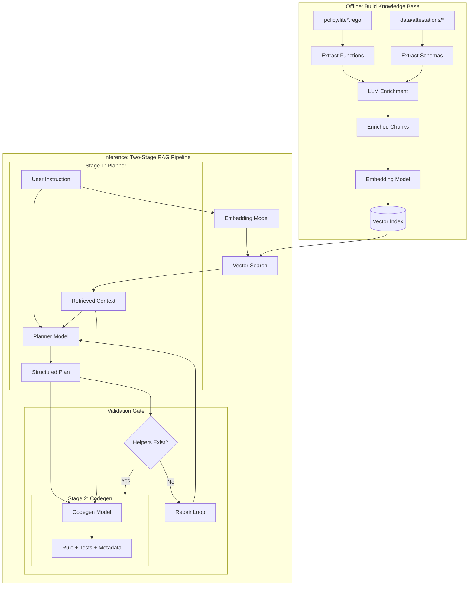
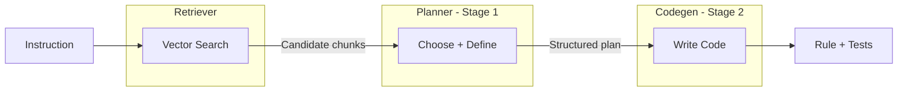
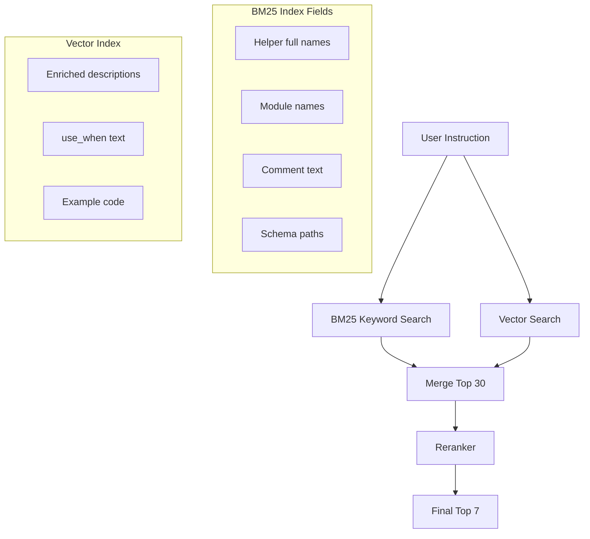

# RAG-Based Context Retrieval for Rego Policy Generation

## Overview

Replace the current Stage 1 "inference" approach with a retrieval-based system. An LLM will pre-process library code and schemas to create enriched metadata, which gets embedded into a vector index. At inference time, relevant snippets are retrieved and provided to the model, eliminating hallucinated helpers and schemas.

## Problem

The current model hallucinates helpers (e.g., `lib.tekton_task_attestations`) and schemas because it relies on memorized patterns from training. When instructions don't match training examples, it invents non-existent code.

## Solution Architecture



### Why Two Stages with Retrieval?

Instead of a single model step, we keep a **Planner → Codegen** architecture:

| Benefit | Description |
|---------|-------------|
| **Debuggability** | Inspect the structured plan to see what helpers/schemas the model chose before code generation |
| **Validation hooks** | Statically check that helper names actually exist in the index before codegen |
| **Repair loops** | If a helper doesn't exist, ask the model to choose another or define it |
| **Separation of concerns** | Planning (what to use) vs codegen (how to write it) are different skills |

The same model weights can be used for both stages with different prompts.

---

## Design Principles

### Principle 1: Retrieval is the Source of Truth

The retrieval index is the **ground truth catalogue** of:
- Libraries (helper functions)
- Schemas (paths, semantics, examples)
- Usage patterns (how helpers + schemas combine)

**Critical Rule:** During training, always simulate real retrieval:

| Wrong | Right |
|-------|-------|
| Hand-pick "ideal" context for each training example | Run actual vector search on the same index used at inference |
| Curate perfect helper/schema combinations | Use whatever the retriever returns, including noise |
| Train on clean context, deploy on noisy context | Train and deploy on identical retrieval behavior |

This prevents train/deploy mismatch where the model learns to use "perfect" context but receives approximate/noisy context at inference time.

```python
# generate_rag_training.py - CRITICAL: Use real retrieval
def generate_training_example(instruction: str, expected_rule: str):
    # WRONG: Hand-pick the "correct" helpers
    # context = hand_picked_helpers[instruction]
    
    # RIGHT: Run actual retrieval (same index as inference)
    retrieved = vector_index.search(embed(instruction), top_k=7)
    
    # The model must learn to work with whatever retrieval returns
    return {
        "instruction": instruction,
        "retrieved_context": format_chunks(retrieved),
        "expected_output": expected_rule
    }
```

### Principle 2: Explicit Component Responsibilities

Each component has a single, well-defined job:



| Component | Input | Output | Responsibility |
|-----------|-------|--------|----------------|
| **Retriever** | User instruction | Top-K candidate chunks | Find potentially relevant helpers and schema chunks |
| **Planner** | Instruction + candidates | Structured JSON plan | Choose which helpers/schemas to use; define new helpers if needed |
| **Codegen** | Instruction + plan + (optional) chunks | Rego rule + tests | Write code using ONLY selected helpers; no invention |

**Why separate Planner and Codegen?**

1. **Debuggability**: When a rule is wrong, inspect the plan first
   - Plan wrong? → Retrieval or planner issue
   - Plan right, code wrong? → Codegen issue

2. **Validation boundary**: Validate the plan before spending tokens on codegen
   - Reject plans with non-existent helpers immediately
   - No wasted codegen on invalid plans

3. **Different skills**: Planning (selection) vs coding (implementation) are different
   - A model might be good at planning but make syntax errors
   - Or good at syntax but pick wrong helpers

4. **Repair granularity**: Fix at the right level
   - Bad helper choice? → Re-run planner only
   - Syntax error? → Re-run codegen only

## Implementation Todos

### Phase 1: Knowledge Base Extraction
| ID | Task | Dependencies | Status |
|----|------|--------------|--------|
| extract-helpers | Extract helper functions with source spans from policy/lib/*.rego | - | Pending |
| mine-usage | Mine usage spans from policy/release/**/*.rego for each helper | extract-helpers | Pending |
| extract-schemas-slsa | Extract schemas from SLSA Provenance attestations | - | Pending |
| extract-schemas-spdx | Extract schemas from SPDX SBOM attestations | - | Pending |
| extract-schemas-cyclonedx | Extract schemas from CycloneDX SBOM attestations | - | Pending |
| canonical-paths | Normalize schema paths to canonical format with IDs | extract-schemas-* | Pending |
| llm-enrich | Build LLM enrichment pipeline with grounding | extract-helpers, mine-usage, canonical-paths | Pending |

### Phase 1b: Indexing (Hybrid + Split)
| ID | Task | Dependencies | Status |
|----|------|--------------|--------|
| index-helpers | Build helper index (BM25 + vector) | llm-enrich | Pending |
| index-schemas | Build schema index (BM25 + vector) | llm-enrich | Pending |
| index-usage | Build usage pattern index (BM25 + vector) | mine-usage | Pending |
| reranker | Integrate cross-encoder reranker | index-* | Pending |
| hybrid-retriever | Build hybrid retriever with multi-query + caps | reranker | Pending |

### Phase 2: Training Data
| ID | Task | Dependencies | Status |
|----|------|--------------|--------|
| training-planner | Create training data for Stage 1 (Planner) with structured JSON output | vector-index | Pending |
| training-codegen | Create training data for Stage 2 (Codegen) from structured plans | training-planner | Pending |
| training-validation | Add validation failure/repair examples to training data | training-planner | Pending |

### Phase 3: Inference Pipeline
| ID | Task | Dependencies | Status |
|----|------|--------------|--------|
| inference-retrieval | Build retrieval component with embedding + vector search | vector-index | Pending |
| inference-planner | Build Stage 1 (Planner) inference with structured output | inference-retrieval | Pending |
| inference-validation | Build validation gate with repair loop | inference-planner | Pending |
| inference-codegen | Build Stage 2 (Codegen) inference | inference-validation | Pending |
| inference-debug | Add debugging/observability for structured plans | inference-codegen | Pending |

### Phase 4: Testing & Docs
| ID | Task | Dependencies | Status |
|----|------|--------------|--------|
| integration-test | Test end-to-end with problematic examples (bundle pinning, GPL licenses, disallowed packages) | inference-codegen | Pending |
| extensibility-docs | Document process for adding new attestation types | integration-test | Pending |

---

## Phase 1: Extract and Enrich Library Code

### 1.1 Extract Helper Functions from `policy/lib/`

Create a script that parses Rego files and extracts:

- Function signatures
- Function bodies (with source spans)
- Existing comments/documentation
- Import relationships
- Module paths (for importability validation)

**Additionally, mine usage spans:**
- Scan `policy/release/**/*.rego` for invocations of each helper
- Record file + line ranges where each helper is used
- Prioritize non-test files, but include tests as examples

```python
def extract_helper(file_path: str, func_name: str, lines: tuple) -> HelperInfo:
    return HelperInfo(
        name=func_name,
        module_path=derive_module_path(file_path),  # e.g., "data.lib.tekton"
        source_span=SourceSpan(file=file_path, lines=lines),
        body=extract_lines(file_path, lines),
        usage_spans=find_usages(func_name, "policy/release/"),  # Mine real usages
        signature=parse_signature(func_name, body),
    )
```

**Target files:**

- `policy/lib/tekton/tekton.rego` - Task helpers
- `policy/lib/sbom/sbom.rego` - SBOM helpers
- `policy/lib/result_helper.rego` - Result helpers
- All other `*.rego` files (excluding `*_test.rego`)

**Mine usage from:**
- `policy/release/**/*.rego` - Production rules
- `policy/release/**/*_test.rego` - Test files (for examples)

### 1.2 Extract Example Schemas from `data/attestations/`

Parse attestation JSON files to extract:

- Schema structure (field paths)
- Example values
- Attestation types

**Supported Attestation Types:**

| Type | Source Files | Key Schemas |
|------|--------------|-------------|
| SLSA Provenance | `data/attestations/slsa-provenance-*.json` | `predicate.buildConfig.tasks[]`, `predicate.materials[]` |
| SPDX SBOM | `data/attestations/spdx-*.json` | `packages[]`, `files[]`, `relationships[]` |
| CycloneDX SBOM | `data/attestations/cyclonedx-*.json` | `components[]`, `dependencies[]`, `metadata` |
| Image Config | `data/attestations/image-config-*.json` | `config.Labels`, `rootfs`, `history[]` |

**Extensibility:** New attestation types can be added by:
1. Adding example JSON files to `data/attestations/`
2. Running the extraction script (auto-discovers new files)
3. Running LLM enrichment on new schemas
4. Rebuilding the vector index

### 1.3 LLM Enrichment (Grounded)

**Key Principle:** LLM enrichment provides descriptions and `use_when`, but must be **grounded with evidence**:

| LLM Generates | Grounded With |
|---------------|---------------|
| `description` | Actual helper body source code |
| `use_when` | Real usage snippets from rules/tests |
| `expects`/`returns` | Parsed signature + actual invocations |
| `canonical_for` | Analysis of existing rule patterns |

**Every enriched chunk includes grounding fields:**

```json
{
  "grounding": {
    "source_span": {
      "file": "policy/lib/tekton/tekton.rego",
      "lines": [142, 158]
    },
    "usage_spans": [
      {"file": "policy/release/.../rule.rego", "lines": [45, 52]},
      {"file": "policy/release/.../rule_test.rego", "lines": [23, 31]}
    ],
    "example_code": "actual code snippet from usage",
    "schema_examples": [
      {"source": "data/attestations/example.json", "fragment": {...}}
    ]
  }
}
```

**Why grounding matters:**
- Model can "read the evidence" instead of trusting LLM summarization
- When enrichment is wrong, the grounding shows the truth
- Usage spans prove the pattern actually works in production
- Schema examples show real field values, not invented ones

**Enrichment prompt includes source:**
```
Given this helper function source code:
---
# From: policy/lib/tekton/tekton.rego:142-158
task_ref(task) := ref if {
    some param in task.ref.params
    param.name == "bundle"
    ref := {
        "bundle": param.value,
        "pinned": contains(param.value, "@sha256:"),
        ...
    }
}
---

And these usage examples from production rules:
---
# From: policy/release/attestation_task_bundle.rego:45-52
deny contains result if {
    some att in lib.pipelinerun_attestations
    some task in tekton.tasks(att)
    not tekton.task_ref(task).pinned
    ...
}
---

Generate enriched metadata for this helper...
```

For each extracted item, use an LLM to generate:

**For helper functions (enriched with grounding):**

```json
{
  "name": "tekton.task_ref",
  "module_path": "data.lib.tekton",
  "exported": true,
  "signature": "task_ref(task)",
  
  "expects": {
    "type": "task",
    "description": "A task object from tekton.tasks(att) or tekton.build_tasks(att)"
  },
  "returns": {
    "type": "object",
    "fields": {
      "pinned": "boolean - true if bundle uses immutable digest",
      "bundle": "string - OCI bundle reference",
      "name": "string - task name",
      "kind": "string - Task or ClusterTask"
    }
  },
  
  "description": "Returns task reference info. Use .pinned to check if task bundle is pinned to immutable digest.",
  "use_when": ["checking task bundle pinning", "validating task references", "verifying immutable task definitions"],
  "canonical_for": ["bundle pinning checks"],
  "prefer_over": ["manually checking @sha256: in bundle string"],
  
  "related_helpers": ["tekton.tasks", "tekton.task_name", "lib.pipelinerun_attestations"],
  
  "grounding": {
    "source_span": {
      "file": "policy/lib/tekton/tekton.rego",
      "lines": [142, 158]
    },
    "usage_spans": [
      {"file": "policy/release/attestation_task_bundle/attestation_task_bundle.rego", "lines": [45, 52]},
      {"file": "policy/release/attestation_task_bundle/attestation_task_bundle_test.rego", "lines": [23, 31]}
    ],
    "example_code": "ref := tekton.task_ref(task)\nnot ref.pinned\nresult := lib.result_helper(rego.metadata.chain(), [tekton.task_name(task)])"
  }
}
```

**For schema fields (with canonical paths and grounding):**

```json
{
  "schema_id": "slsa_v1_task_bundle",
  "canonical_path": "$.predicate.buildConfig.tasks[*].ref.bundle",
  "attestation_type": "slsa_provenance",
  "slsa_versions": ["v1.0", "v0.2"],
  
  "aliases": [
    "att.statement.predicate.buildConfig.tasks[].ref.bundle",
    "predicate.buildConfig.tasks[].ref.bundle"
  ],
  
  "type": "string",
  "nullable": false,
  "presence": {
    "condition": "Task uses bundle resolver",
    "absent_when": "Task uses git resolver or inline definition"
  },
  
  "description": "OCI bundle reference for the task. May include @sha256: digest if pinned.",
  "use_when": ["task bundle validation", "checking pinned references"],
  
  "grounding": {
    "schema_examples": [
      {
        "source": "data/attestations/slsa-provenance-example-1.json",
        "fragment": {"ref": {"bundle": "quay.io/konflux-ci/buildah@sha256:abc123...", "name": "buildah", "kind": "Task"}}
      },
      {
        "source": "data/attestations/slsa-provenance-unpinned.json",
        "fragment": {"ref": {"bundle": "quay.io/konflux-ci/buildah:v1.0", "name": "buildah"}}
      }
    ],
    "usage_spans": [
      {"file": "policy/release/attestation_task_bundle/attestation_task_bundle.rego", "lines": [48, 50]}
    ]
  },
  
  "related_fields": ["$.predicate.buildConfig.tasks[*].ref.name", "$.predicate.buildConfig.tasks[*].name"]
}
```

**Why canonical paths and IDs?**

| Problem | Solution |
|---------|----------|
| Path drift across SLSA versions | Store `slsa_versions` array, normalize to canonical path |
| Optional fields cause mismatches | Store `presence` conditions |
| Planner outputs "close but not real" paths | Use stable `schema_id` in plans, validate against canonical |
| Envelope nesting varies (DSSE, in-toto) | Aliases handle variations |

**Planner uses IDs, not raw paths:**
```json
{
  "schemas": ["slsa_v1_task_bundle", "slsa_v1_task_name"],
  ...
}
```

**SBOM schema example (SPDX):**

```json
{
  "path": "packages[].licenseConcluded",
  "type": "string",
  "attestation_type": "spdx_sbom",
  "description": "SPDX license identifier for the concluded license. Use this field (not externalRefs) for license checks.",
  "use_when": ["license compliance", "GPL detection", "license allowlist validation"],
  "example_value": "Apache-2.0",
  "common_values": ["Apache-2.0", "MIT", "GPL-2.0-only", "GPL-3.0-only", "NOASSERTION"]
}
```

**SBOM schema example (CycloneDX):**

```json
{
  "path": "components[].licenses[].license.id",
  "type": "string",
  "attestation_type": "cyclonedx_sbom",
  "description": "SPDX license ID for the component. Iterate over component.licenses array to check licenses.",
  "use_when": ["license compliance", "component license validation"],
  "example_value": "Apache-2.0"
}
```

---

## Phase 2: Build Vector Index

### 2.1 Chunking Strategy

Create chunks that are self-contained and searchable:

| Chunk Type | Content | Size |
|------------|---------|------|
| Function | Signature + enriched metadata + body | ~500 tokens |
| Schema Path | Path + description + example | ~200 tokens |
| Usage Pattern | Helper + schema combination | ~300 tokens |

### 2.2 Hybrid Retrieval Architecture

Vector-only retrieval misses exact-symbol queries, and Rego is **symbol-heavy** (`tekton.task_ref`, `lib.pipelinerun_attestations`).

**Recommended Stack:**



**Why hybrid?**

| Query Type | BM25 Wins | Vector Wins |
|------------|-----------|-------------|
| "tekton.task_ref" | ✅ Exact match | ❌ May return similar names |
| "check if bundle is pinned" | ❌ No keywords match | ✅ Semantic match |
| "GPL license validation" | Mixed | ✅ Semantic match |

**Reranker (critical for quality):**

```python
class HybridRetriever:
    def __init__(self):
        self.bm25 = BM25Index()
        self.vector = FAISSIndex()
        self.reranker = CrossEncoderReranker("cross-encoder/ms-marco-MiniLM-L-6-v2")
    
    def retrieve(self, query: str, top_k: int = 7) -> List[Chunk]:
        # Step 1: Get candidates from both indexes
        bm25_results = self.bm25.search(query, k=20)
        vector_results = self.vector.search(embed(query), k=20)
        
        # Step 2: Merge and deduplicate
        candidates = merge_dedupe(bm25_results, vector_results)[:30]
        
        # Step 3: Rerank with cross-encoder
        scored = self.reranker.score(query, candidates)
        
        # Step 4: Return top-k
        return sorted(scored, key=lambda x: x.score, reverse=True)[:top_k]
```

### 2.3 Split Indexes by Chunk Type

Helpers, schemas, and usage patterns have **different distributions**. Query them separately and merge with caps.

**Three Indexes:**

| Index | Contains | Query Intent |
|-------|----------|--------------|
| **A: Helpers** | Function signatures, descriptions, expects/returns | "What helpers do X?" |
| **B: Schemas** | Field paths, types, presence conditions | "What fields exist for Y?" |
| **C: Usage Patterns** | Real code snippets from production rules | "How is Z used in practice?" |

**Multi-Query Strategy:**

```python
def retrieve_with_intent(instruction: str) -> RetrievalResult:
    # Generate intent-specific queries
    helper_query = f"helper function for: {instruction}"
    schema_query = f"schema fields needed for: {instruction}"
    usage_query = f"example code for: {instruction}"
    
    # Query each index
    helpers = helper_index.search(helper_query, k=6)
    schemas = schema_index.search(schema_query, k=4)
    usage = usage_index.search(usage_query, k=3)
    
    # Merge with caps
    return RetrievalResult(
        helpers=helpers[:4],      # Max 4 helper chunks
        schemas=schemas[:2],      # Max 2 schema chunks
        usage_patterns=usage[:1]  # Max 1 usage pattern
    )
```

**Why caps?**

| Without caps | With caps |
|--------------|-----------|
| 6 helper chunks, 0 schemas | 4 helpers + 2 schemas |
| Model doesn't know what fields exist | Balanced context |
| May pick wrong iteration pattern | Sees field structure |

### 2.4 Embedding and Indexing

- **Embedding model**: `sentence-transformers/all-MiniLM-L6-v2` or `bge-small-en-v1.5`
- **BM25 index**: Elasticsearch, or in-memory with `rank_bm25` library
- **Vector store**: FAISS (simple) or ChromaDB (with metadata filtering)
- **Reranker**: `cross-encoder/ms-marco-MiniLM-L-6-v2` (fast, good quality)

---

## Phase 3: Training Data Format

### 3.1 Stage 1 (Planner) Format

**Input:** Instruction + Retrieved Context

**Output:** Structured plan (JSON) specifying what to use

```json
{
  "package": "task_bundle_pinning",
  "rule_type": "deny",
  "attestation_type": "slsa_provenance",
  "schemas": [
    "att.statement.predicate.buildConfig.tasks[].ref.bundle",
    "att.statement.predicate.buildConfig.tasks[].ref.name"
  ],
  "helpers": [
    "lib.pipelinerun_attestations",
    "tekton.tasks",
    "tekton.task_ref",
    "tekton.task_name",
    "lib.result_helper"
  ],
  "new_helpers": [],
  "iteration_pattern": "some att in lib.pipelinerun_attestations; some task in tekton.tasks(att)",
  "condition": "not tekton.task_ref(task).pinned",
  "rationale": "Use tekton.task_ref(task).pinned to check if bundle is pinned to immutable digest"
}
```

**SBOM Example (GPL License Check):**
```json
{
  "package": "gpl_license_check",
  "rule_type": "deny",
  "attestation_type": "spdx_sbom",
  "schemas": [
    "packages[].licenseConcluded",
    "packages[].name"
  ],
  "helpers": [
    "sbom.spdx_sboms",
    "lib.result_helper"
  ],
  "new_helpers": [],
  "iteration_pattern": "some s in sbom.spdx_sboms; some pkg in s.packages",
  "condition": "contains(pkg.licenseConcluded, \"GPL\"); not contains(pkg.licenseConcluded, \"LGPL\")",
  "rationale": "Check licenseConcluded field directly - do not use externalRefs for license checks"
}
```

**With Custom Helper Definition:**
```json
{
  "package": "task_bundle_validation",
  "rule_type": "deny",
  "attestation_type": "slsa_provenance",
  "schemas": ["att.statement.predicate.buildConfig.tasks[].ref"],
  "helpers": ["lib.pipelinerun_attestations", "tekton.tasks"],
  "new_helpers": [
    {
      "name": "_format_bundle_ref",
      "signature": "_format_bundle_ref(task)",
      "reason": "Format bundle reference for error messages",
      "implementation": "sprintf(\"%s@%s\", [tekton.task_name(task), tekton.task_ref(task).bundle])"
    }
  ],
  "iteration_pattern": "some att in lib.pipelinerun_attestations; some task in tekton.tasks(att)",
  "condition": "not contains(tekton.task_ref(task).bundle, \"@sha256:\")"
}
```

### 3.2 Validation Gate (Deep Validation)

"Helper exists" is necessary but **not sufficient**. Validate multiple dimensions:

```python
@dataclass
class ValidationResult:
    valid: bool
    errors: List[str]
    warnings: List[str]

def validate_plan(plan: dict, knowledge_base: KnowledgeBase) -> ValidationResult:
    errors = []
    warnings = []
    
    # 1. EXISTENCE: Does the helper exist?
    for helper in plan["helpers"]:
        if helper not in knowledge_base.helpers:
            errors.append(f"Helper '{helper}' not found")
            continue
        
        helper_info = knowledge_base.helpers[helper]
        
        # 2. IMPORTABILITY: Can we import it from the target package?
        if not is_importable(helper_info.module_path, plan["package"]):
            errors.append(
                f"Helper '{helper}' from {helper_info.module_path} "
                f"cannot be imported in package {plan['package']}"
            )
        
        # 3. TYPE COMPATIBILITY: Does iteration produce the right input type?
        expected_input = helper_info.expects
        actual_input = infer_type_from_iteration(plan["iteration_pattern"])
        if not types_compatible(actual_input, expected_input):
            errors.append(
                f"Helper '{helper}' expects {expected_input}, "
                f"but iteration produces {actual_input}"
            )
        
        # 4. SEMANTIC CHECK: Is this the canonical approach?
        if helper_info.canonical_alternative:
            warnings.append(
                f"Consider using '{helper_info.canonical_alternative}' "
                f"instead of '{helper}' - it's the preferred approach"
            )
    
    # 5. SCHEMA VALIDATION: Use IDs, not raw paths
    for schema_ref in plan["schemas"]:
        if not knowledge_base.schema_exists(schema_ref, plan["attestation_type"]):
            errors.append(f"Schema '{schema_ref}' not found for {plan['attestation_type']}")
    
    return ValidationResult(
        valid=len(errors) == 0,
        errors=errors,
        warnings=warnings
    )
```

**Validation Dimensions:**

| Check | What it catches |
|-------|-----------------|
| Existence | Hallucinated helper names |
| Importability | Helpers from wrong module paths |
| Type compatibility | Passing `task` to a function expecting `attestation` |
| Semantic check | Using workarounds instead of canonical helpers |
| Schema validation | Non-existent or mistyped field paths |

**Repair Loop:** If validation fails, re-prompt the planner:
```
Your plan referenced helpers that don't exist:
- lib.tekton_task_attestations (NOT FOUND)

Available alternatives from retrieved context:
- lib.pipelinerun_attestations
- tekton.tasks(att)

Please revise your plan.
```

### 3.3 Stage 2 (Codegen) Format

**Input:** Structured plan + Retrieved context (optional) + Instruction

**Output:** Complete Rego rule with tests and metadata

### 3.4 Training Data Generation (CRITICAL)

The `generate_rag_training.py` script must use **real retrieval** to create training examples:

```python
class RAGTrainingGenerator:
    def __init__(self, vector_index, existing_rules_dir):
        self.index = vector_index  # Same index used at inference
        self.rules = load_existing_rules(existing_rules_dir)
    
    def generate_dataset(self) -> List[TrainingExample]:
        examples = []
        
        for rule in self.rules:
            instruction = rule.instruction
            expected_plan = extract_plan_from_rule(rule)
            expected_code = rule.code
            
            # CRITICAL: Use real retrieval, not hand-picked context
            retrieved = self.index.search(embed(instruction), top_k=7)
            
            # Stage 1 example: instruction + retrieved → plan
            examples.append(TrainingExample(
                stage="planner",
                input={
                    "instruction": instruction,
                    "retrieved_context": format_chunks(retrieved)
                },
                output=expected_plan
            ))
            
            # Stage 2 example: instruction + plan → code
            examples.append(TrainingExample(
                stage="codegen",
                input={
                    "instruction": instruction,
                    "plan": expected_plan,
                    "retrieved_context": format_chunks(retrieved)  # Optional
                },
                output=expected_code
            ))
        
        return examples
```

**Why this matters:**

| Scenario | Training Context | Inference Context | Result |
|----------|------------------|-------------------|--------|
| Wrong | Hand-picked "perfect" helpers | Real retrieval (noisy) | Model confused by noise |
| Right | Real retrieval (noisy) | Real retrieval (noisy) | Model learns to handle noise |

The model will sometimes receive irrelevant chunks in the retrieved context. It must learn to:
1. Identify which chunks are actually relevant
2. Ignore irrelevant chunks
3. Work with approximate matches

### 3.5 Retrieved Context Examples

**Example 1: Task Bundle Pinning (SLSA Provenance)**
```
INSTRUCTION:
Write a Rego rule that denies if any Tekton task bundle is not pinned to a digest

RETRIEVED_CONTEXT:
--- Helper: tekton.task_ref ---
Signature: task_ref(task)
Returns: Object with .pinned, .bundle, .name, .kind fields
Description: Returns task reference info. Use .pinned to check if task bundle is pinned.
Example:
  ref := tekton.task_ref(task)
  not ref.pinned
Related: tekton.tasks, lib.pipelinerun_attestations

--- Helper: tekton.tasks ---
Signature: tasks(attestation)
Description: Returns all tasks from a PipelineRun attestation
Example: some task in tekton.tasks(att)

--- Schema: att.statement.predicate.buildConfig.tasks[].ref.bundle ---
Type: string
Attestation: slsa_provenance
Description: OCI bundle reference for the task, may include @sha256: digest
```

**Example 2: GPL License Check (SPDX SBOM)**
```
INSTRUCTION:
Write a Rego rule that denies if any SBOM package uses a GPL license

RETRIEVED_CONTEXT:
--- Helper: sbom.spdx_sboms ---
Signature: spdx_sboms
Description: Returns all SPDX format SBOMs from attestations
Example: some s in sbom.spdx_sboms

--- Schema: packages[].licenseConcluded ---
Type: string
Attestation: spdx_sbom
Description: SPDX license ID for the concluded license. Use this field for license checks.
Example values: "Apache-2.0", "MIT", "GPL-2.0-only", "NOASSERTION"
Note: Do NOT use externalRefs for license checking - use licenseConcluded directly.

--- Schema: packages[].name ---
Type: string
Attestation: spdx_sbom
Description: Package name for error messages
```

**Example 3: Disallowed Packages (CycloneDX SBOM)**
```
INSTRUCTION:
Create a policy that blocks disallowed packages in the SBOM

RETRIEVED_CONTEXT:
--- Helper: sbom.cyclonedx_sboms ---
Signature: cyclonedx_sboms
Description: Returns all CycloneDX format SBOMs from attestations
Example: some s in sbom.cyclonedx_sboms

--- Helper: lib.rule_data ---
Signature: rule_data(key)
Description: Retrieves configurable policy data by key name
Example: disallowed := lib.rule_data("disallowed_packages")

--- Schema: components[].name ---
Type: string
Attestation: cyclonedx_sbom
Description: Component name to check against disallowed list
```

### 3.2 Training Output

The model learns to USE the retrieved context:

```
ANALYSIS:
Based on the retrieved context:
- Use lib.pipelinerun_attestations to iterate attestations
- Use tekton.tasks(att) to get tasks
- Use tekton.task_ref(task).pinned to check bundle pinning

RULE:
```rego
deny contains result if {
    some att in lib.pipelinerun_attestations
    some task in tekton.tasks(att)
    not tekton.task_ref(task).pinned
    result := lib.result_helper(rego.metadata.chain(), [tekton.task_name(task)])
}
```
```

### 3.3 Generate Training Examples

For each existing training example:
1. Simulate retrieval by finding relevant helpers/schemas
2. Format as instruction + retrieved_context + output
3. Ensure the output references the retrieved context

---

## Phase 4: Inference Pipeline

### 4.1 New Inference Flow

```python
def generate_rule(instruction: str, max_repair_attempts: int = 2) -> GenerationResult:
    # Step 1: Retrieve relevant context
    query_embedding = embed(instruction)
    relevant_chunks = vector_index.search(query_embedding, top_k=7)
    retrieved_context = format_retrieved_context(relevant_chunks)
    
    # Step 2: Stage 1 - Generate structured plan
    plan = None
    for attempt in range(max_repair_attempts + 1):
        plan_prompt = format_planner_prompt(instruction, retrieved_context, 
                                            previous_errors=plan.errors if plan else None)
        plan_json = planner_model.generate(plan_prompt)
        plan = parse_plan(plan_json)
        
        # Step 3: Validate plan
        validation = validate_plan(plan, helper_index, schema_index)
        if validation.valid:
            break
        plan.errors = validation.errors
    
    if not validation.valid:
        return GenerationResult(success=False, errors=validation.errors)
    
    # Step 4: Stage 2 - Generate code from plan
    codegen_prompt = format_codegen_prompt(instruction, plan, retrieved_context)
    rule_output = codegen_model.generate(codegen_prompt)
    
    return GenerationResult(
        success=True,
        plan=plan,
        rule=rule_output.rule,
        tests=rule_output.tests,
        metadata=rule_output.metadata
    )
```

### 4.2 Pipeline Integration

| Current | New (RAG + Two-Stage) |
|---------|----------------------|
| Stage 1: Infer context (model memorizes) | **Retrieval**: Vector search for relevant helpers/schemas |
| - | **Stage 1 (Planner)**: Instruction + retrieved context → structured plan |
| - | **Validation Gate**: Check helpers/schemas exist, repair if needed |
| Stage 2: Generate rule | **Stage 2 (Codegen)**: Structured plan + context → rule + tests |

### 4.3 Debugging and Observability

The structured plan enables rich debugging:

```python
@dataclass
class GenerationResult:
    success: bool
    plan: Optional[StructuredPlan]       # What the model decided to use
    retrieved_chunks: List[Chunk]         # What was retrieved
    validation_attempts: int              # How many repair loops needed
    rule: Optional[str]
    tests: Optional[str]
    errors: Optional[List[str]]
    
def debug_generation(result: GenerationResult):
    print("=== Retrieved Context ===")
    for chunk in result.retrieved_chunks:
        print(f"  - {chunk.type}: {chunk.name}")
    
    print("=== Structured Plan ===")
    print(f"  Package: {result.plan.package}")
    print(f"  Helpers: {result.plan.helpers}")
    print(f"  Schemas: {result.plan.schemas}")
    print(f"  Condition: {result.plan.condition}")
    
    if result.plan.new_helpers:
        print("=== Custom Helpers ===")
        for h in result.plan.new_helpers:
            print(f"  - {h.name}: {h.reason}")
```

---

## File Structure

```
scripts/
  build_knowledge_base.py     # Extract and enrich library code
  build_vector_index.py       # Create embeddings and index
  generate_rag_training.py    # Generate training data with retrieved context

data/
  attestations/               # Example attestation files (add new types here)
    slsa-provenance-*.json    # SLSA Provenance attestations
    spdx-*.json               # SPDX SBOM attestations
    cyclonedx-*.json          # CycloneDX SBOM attestations
    image-config-*.json       # Image configuration
    
  knowledge_base/
    helpers.jsonl             # Enriched helper function metadata
    schemas/
      slsa_provenance.jsonl   # SLSA Provenance schema fields
      spdx_sbom.jsonl         # SPDX SBOM schema fields
      cyclonedx_sbom.jsonl    # CycloneDX SBOM schema fields
      image_config.jsonl      # Image config schema fields
    index/                    # Vector index files

src/
  infer_rag.py               # New RAG-based inference
```

---

## Extensibility: Adding New Attestation Types

To add support for a new attestation type (e.g., Sigstore attestations):

### Step 1: Add Example Files
```bash
# Add example attestation JSON files
cp new-attestation.json data/attestations/sigstore-example-1.json
```

### Step 2: Run Extraction
```bash
# Script auto-discovers new files and extracts schemas
python scripts/build_knowledge_base.py --extract-schemas
```

### Step 3: Run LLM Enrichment
```bash
# Enrich new schemas with descriptions, use_when, examples
python scripts/build_knowledge_base.py --enrich --attestation-type sigstore
```

### Step 4: Rebuild Vector Index
```bash
# Rebuild index to include new schemas
python scripts/build_vector_index.py --rebuild
```

### Step 5: (Optional) Add Training Examples
```bash
# Generate training examples using new attestation type
python scripts/generate_rag_training.py --include-type sigstore
```

**No model retraining required** for basic retrieval - the new schemas will be retrieved and provided to the model. Retraining is only needed if the model struggles to use the new schema format.

---

## Key Decisions

1. **Retrieval strategy**: Hybrid BM25 + Vector with cross-encoder reranking
2. **Embedding model**: `sentence-transformers/all-MiniLM-L6-v2` (fast, good accuracy)
3. **Reranker**: `cross-encoder/ms-marco-MiniLM-L-6-v2` (rerank top 30 → top 7)
4. **Index split**: Separate indexes for helpers, schemas, usage patterns
5. **Vector store**: FAISS (simple, no external dependencies)
6. **BM25**: `rank_bm25` library or Elasticsearch
7. **Top-K with caps**: 4 helpers + 2 schemas + 1 usage pattern = 7 chunks
8. **Chunk overlap**: Include related helpers in each chunk for better context

---

## Handling Noisy Retrieval

Real retrieval won't always return perfect results. The system must handle:

### Scenario 1: Relevant chunk not in top-K

**Problem:** The best helper exists but wasn't retrieved.

**Mitigation:**
- Higher K (7-10 instead of 5)
- Better embeddings (domain-specific fine-tuning)
- Hybrid search (embedding + keyword)

**Fallback:** Planner can specify `new_helpers` if nothing suitable found.

### Scenario 2: Irrelevant chunks in top-K

**Problem:** Retrieved chunks include unrelated helpers.

**Training solution:** The planner learns to select only relevant chunks.

```
RETRIEVED_CONTEXT:
- tekton.task_ref (relevant)
- sbom.spdx_sboms (irrelevant for this task)
- tekton.tasks (relevant)
- image.config (irrelevant for this task)

PLAN:
{
  "helpers": ["tekton.task_ref", "tekton.tasks"],  // Selected only relevant
  ...
}
```

### Scenario 3: Similar but wrong helper

**Problem:** Retrieved `lib.taskrun_attestations` when user needs `lib.pipelinerun_attestations`.

**Training solution:** Include negative examples in training:
- Show cases where similar-named helpers are rejected
- Emphasize reading the description/usage to distinguish

**Validation solution:** Planner output is validated; wrong helpers caught before codegen.

---

## Benefits

1. **No hallucinated helpers** - They come from actual code in the vector index
2. **Extensibility** - New helpers can be added by updating the index, no retraining needed
3. **Grounded outputs** - Model references actual code rather than memorized patterns
4. **Better generalization** - Model learns to READ code, not memorize specific phrasings

